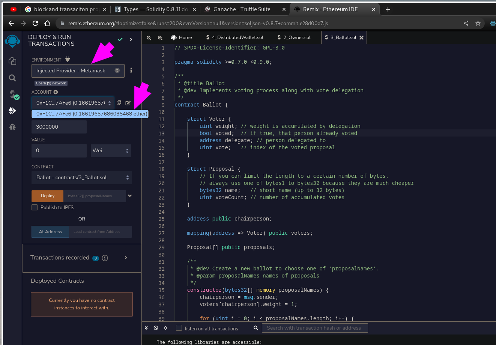

# Readme

## App Screenshots:

**Withdraw dex to wallet:**


**Calling Deposit:**


**All orders:**

The orders are ordered by best prices in buy (maximum price first) and sell sections (lease price first) thus execution of market orders will first perform those orders in same order.


## TODO: ❤️ PENDING THINGS TO TRY OUT ❤️

- Why safe math for sum and subtract? Hot to use those two implementation/techniques directly in the code without using SafeMath library?
- What is validator and how to run it? What is merge of PoW to PoS?
- Try forking with hardhat and truffle.
- Try debugger with hardhat and solidity compiler to see runtime values with a real debugger.

What is blockchain? ~Julien Klepatch

It is a special kind of db, and its main fn is to store data. Like its name implies it is a series of block of data. These blocks are linked to each other with cryptography.

Each block has two parts:
1. metadata: Timestamp at which the block was created and reference to previous block and a cryptographic signature of all the transactions.
2. transaction: describes how data changes. For e.g., for bitcoin a tx describes how bitcoin is transferred from an account to another one.

A blockchain is different from any traditional db coz you can not change data that's already on blockchain i.e., DATA IS IMMUTABLE. It is decentralized and censorship resistant, so a single actor can not control the network.

Blockchian network: A blockchain doesnot run on a single computer but instead it runs on a network of computers that are connected to each other, each one is called node and they together form a blockchain network. Anybody can run a node and can be a part of blockchian network. Thats why we say blockchain runs on a public network.

There are already databases which can run on multiple nodes, these are called distributed dbs. However none of them run on public network, they all run on private network.

So if anybody can run a node in BNwk (Blockchain Network) how can these networks be secure? Ans. For security we have mining process. If you want to add data to blockchain, you need to add a new block to blockchain with all the transaction data that needs to be in blockchain as you desire. If you want to do this you need to be engaged in a process called mining. Any node no blockchain can be a miner. When you are miner, you compete with other miners on the network to solve a mathematical equation. The first miner who solves this mathematical eqn has the right to add the next block to the blockchain. This mining process is described as Proof-Of-Work (POW). It is almost impossible to hack POW algorithm.

Whats great about POW?
1. It is very difficult to hack.
2. It doesn't rely on any centralized body.

Cons of our special kind of Database (Blockchain)?
- It is much much slower than traditional db bcoz you have to synchronize data across whole network that usually is distributed globally.
- It is less scalable.
- It is much expensive coz you have to pay miners their service for adding data to blockchain.
- They are completely public so there is no privacy, any data you put on blockchain can be seen by anybody.

Addresses are not managed by cryptocurrencies and anybody is free to create as many addresses as they want using some wallets.

New bitcoins are regularly created by the blockchain to reward the miner who successfully added the block. This creation of new bitcoins is not infinite and will stop at somepoint which will limit the inflation of the bitcoin.

We can use bitcoin scripting to perform more complex transactions by using bitcoin scripting. But it is not very powerful, very few people use that and generally speaking its not very easy to build blockchain apps on top of bitcoin.

Ethereum is blockchain of 2nd generation capable of not only processing simple financial transaction but also any arbitary computation. This allowed to build much more sophisticated applications on top of ethereum blockchain.

On top of this basic blockchain technology, there's another part Ethereum Virtual Machine. So, EVM's are capable of running small programs called Smart Contracts. These SC can run code and manipulate the cryptocurrency i.e., ether. Also, with smart contracts you can code a multisignature wallet where you need to approval of serveral people before spending any ether. The beauty of Smart Contract is that their code is executed on blockchain so you don't need any third party to execute them. Once the code of the smart contract is deployed on the blockchain nobody can is able to change the the code and stop the code to run and its just going on blockchian forever. Some contracts were did get hacked becoz of the bug in the code of the smart contract but never becoz of the ethereum technogoloy.

Transaction in are identified by hash. A Cryptographic has is a fingerprint, it uniquely identifies a piece of data. It looks like a gibberish text. So if we change one digit of the data, the hash will be completely different. We can produce the cryptographic hashes via cryptographic functions, like sha2, sha3. Hashes are fixed size of characters for any size of data. Cryptographic hashing is one way function.

On ethereum the cryptographic fn used is Keccak256, it is very similar to sha3.

In ethereum the role of addresses is to send and receive ether.

How ethereum addresses are created?
1. Private key - a very long number which is generated randomly. It must be kept secret like a password.
2. Elliptic cryptography, we generate another long number i.e., public key.
3. We can get public key from private key easily but not the other wa y around. Public key is 128char long. We compute a cryptographic hash of this public key using KECHAK256 hash fn, in other words we compute a fingerprint of this public key. This fingerprint is a string which is 64char long, we take the last 42char and finally we prefix it with 0x so in the end we have a string of 42 chars and thats our address.

<<<<<<< HEAD
- We can give the address to anyone if we want to receive some ether.
- We can use private key which we used to generate the address, if we want to send ether to another address. Technically that's called to sign a transaction.


Where are these addresses created?
They are not created in ethereum blockchain, but these are created by external softwares called wallets. Metamask (chrome extension) and nano ledge (a physical wallet).

Wallets first randomly generate private key and it computes a public key from that private key, and finaly derives an ethereum address. For most people 1 address is not enough. Users may use 1 account for savings and other account for current operations, etc. Fortunately a wallet can generate multiple ethereum addresses, and wallet uses a single private key to generate multiple addresses. Wallets use Hierarchical Deterministic Wallet (HD Wallet). How does this process works? BIP32, BIG39 are used to do that.

How can we gurantee that two different person don't generate same address?
It is actually possible becoz if two different wallets generate same private key then same ethereum addresses will be generated and one person would be able to steal ether of another person, this is called an address collission. However the likelihood of this to happen is so low you don't have to worry about it.
Also, if someone steals your private key, then he/she can steal all your ether. Physical wallets (like nano ledget) are safer to use, but are less convenient to use. Thats why we should keep most of their crypto saving in a physical wallet like nano ledger and also keep small a small buffer in a software wallet like metamask for current operations.

Also, if you loose access to private key, you'll be unable to spend your ether so its always recommended to use a backup of private key. Several ways to do this is
- to copy on paper to a paper (but its not very convenient coz its very long text)
- wallets give you MEMOIC PHRASES, they represent your private key with 12 words. Its much more user friendly to manipulate this.

Besides creating addresses, the other function of wallets is to sign transactions using private keys and thats what allows us to spend ethers.

What is ethereum transaction?
It is a signed package of data that describes an action that you want to take on blockchain. Three types kind of transactions:
- send ether to another address
- execute smart contract
- create smart contract


Fields of tx:
- from: thats the address that send and sign the transaction
- to: 1. if we send ether then this will be the address of recepient, or 2. we if we execute teh smart contract then this will be the address of smart contract, or if 3. we create a new smart contract then this will be empty
- gas: it is the amount of ether which we're willing to pay to miners to include our transaction on the blockchain
- gasPrice: 
- value: we only fill this field if we want to send ether to someone else
- data: we use this field when we want to call a fn on the smart contract, so it describes which function we wanna call and with which argument and then you have the optional nonce field and this allows you overwrite a previous transaction.

Node, once the transaction has been mined on the ethereum blockchain the wallet will provide the TRANSACTION HASH which is a identifier for the transaction on the blockchain.

You can use this transaction hash to verify the transaction has been mined using a tool i.e., etherscan website.

## LIFECYCLE OF TRANSACTION:

1. Wallet builds the tx and it fills all the details we discussed above.
2. Wallet signs the tx using the private key associated with our address.
3. Wallet send the tx to ethereum blockchain
4. A miner will keep the transaction and add it as next block in the blockchain (IT TAKES AROUND 15 seconds)

How integrity of this tx is ensured?
Since we signed the tx, all the nodes know the tx hash and thus changing the data will modify the signature then the ethereum blockchain will check the fact that the tx is invalid and it will be rejected.
After the transaction is processed by miner and included the block in blockchian, you'll be able to see the sideeffect of the transaction. So if you send the ether you'll see the updated balances, or if you executed the fn of the smart contract you'll also be able to see the updated data. You can check if the transaction actually took place by using a blockchain explorer and for ethereum it is a famous one i.e., ether scan.

What are smart contract?
Smart contracts are really what makes ethereum so special. It is a small program that runs on etherum blockchain. Smart contracts have some properties that make them very different from other programs.

Smart Contract PROS:
- code is immutable (so once you deploy smart contracts, its impossible to update it so you'll have the gurantee that the code will run exactly as it was deployed)
- smart contracts are sensorship resistant, once you deploy them no government or organization can stop them. Not even the creator of the smart contract.
- no need of servers: So smart contracts don't require need of any servers, you can just deploy them to blockchain and forget about them.
- very safe: If they have no bug in the code, then code is almost impossible to hack.
- easy to transfer money: Smart contract can natively transfer the ether (crypto currency of ethereum blockchain). In other words if we want to manipulate money you have to do complex integrations with payment processors like paypal and stripe and thats not ideal. With ethereum its very simple.

Smart contract CONS:
- expensive: its expensive to run smart contracts coz we need to pay something we call gas to the miners
- very slow: smart contracts are very slow, when we want to interact with smart contract we need to send a transaction and wait for this transaction to be picked up by a miner and it takes average of 15s.
- smart contract have very limited capabilities compared to other programs for. e.g., you can't store too much data in them and you can't run any computation that is too complicated.
- no future scheduling: You can't schedule to run a smart contract in a future time (very similar to what we usually do with cron jobs)
- cannot call api: We cannot call anyapi which is outside the blockchain.

How smart contract works?
-------------------------

Smart contract has an etherum address, some code and some data that they run on blockchain. First you need to write the code of the smart contract and you can use a programming lanaguage like solidity to do that. Then you need to compile this code to what we call "EVM Bytecode". The EVM is the part of etherum blockchain that runs the smart contract. The EVM doesn't know how to run solidity, it only know how to run some elementry instructions. EVM bytecode is the series of this elementary instructions. So once you compile the smart contract and you have this EVM bytecode, you need to create your smart contract on blockchain. For that you need to create a transaction which is the EVM bytecode and you send it to blockchain. The miner will mine the transaction and the smart contract will be created and after that you can interact with the smart contract. To do that you create all the transactions where you specify which function of the smart contract you want to call. It could be a sum function, it can send ether to some addresses, perform some computations and a function can call function on another smart contract and that means a smart contract can execute some other smart contract in a blockchain and thats very very powerful.


--- stopped making notes from video 10.

--- 

## Uniswap

Amazing Cryptocurrency Decentralized Exchage https://youtu.be/dIneNZTnFMw

Three major types of dapps
1. defi - Decentralized Finance - Finance reinvented on blockchain
Dai - A stable coin, a financial asset thats going to be same value i.e, 1dai = 1 dollar
Uniswap - Decentralized Finance
2. games
CryptoKitties - Allows you to buy and breed virtual kitties on blockchain
3. Gambling

We're going to build defi app which integrates with Dai stable coin.

## Should we use backend server for dapps?

Yes, you can use a backend to cache results of the blockchain so that users get better experience while using the dapp.G

## Vyper?

Solidity and vyper are two widely used programming tools to write smart contracts, but solidity is most popular in industry.

# SOLIDITY BY EXAMPLE

https://solidity-by-example.org/

Youtube Channle: https://www.youtube.com/channel/UCJWh7F3AFyQ_x01VKzr9eyA

# TODO:

- Do the `solidity-by-example` for practising with solidity side by side as you do projects. They have YouTube channel as well.

## Resources

- Top 100 crypto currencies: https://coinmarketcap.com/
- Solidity Docs: https://docs.soliditylang.org/en/v0.8.17/


## types of variables

1.fixed-size types: bool, uint, address, bytes32 (a string data type, but value can not exceed 32 bytes)
2. variable-size types: string, bytes, uint[], mapping
3. user-defined data:
struct (e.g., struct User {uint: id; string name; uint[] friendIds})
enum Color { RED, GREEN, BLUE}

Note: In solidity array type i.e., uint[] the values of the array have to be of the same type i.e., uint only.

Note: Mappings are an associative array i.e., they have keys and key maps to values. We define mappings via by defining `keyType` and `valueType` defined by each key. e.g., mapping(uint => string) users;

Builtin variables:
msg.sender = sender's address
msg.value = amount of ether
now() = unix timestamp

Data Types @ solidity docs: https://docs.soliditylang.org/en/v0.8.11/types.html#address

Units and Globally Available Variables: https://docs.soliditylang.org/en/v0.8.11/units-and-global-variables.html

A constructor is called only when the contract is deployed.

Before ver0.5, solidity allowed to make constructor to made via making a function of same name as the name of the constructor. From ver0.5 they removed that way of doing it.

1. Assigning value to contract at deploy time: (vid: lesson22.mp4)

```sol
pragma solidity ^0.6.0;
constract MyContract{
	uint a;

	constructor(uint _a) public {
		a = _a;
	}
}
```

Learn: `view` keyword is used to say if a function is readonly i.e., can not modify smart contract's values.

```sol
// Learn getting and setting values in a contract via functions
pragma solidity ^0.6.0;
constract MyContract{
	uint value;

	function getValue() extrenal view returns(uint) {
		return value;
	}

	function setValue(uint _value) extrenal {
		value = _value;
	}
```

```sol
// Learn visibility keywords:
pragma solidity ^0.6.0;
constract MyContract{
	uint value;

	// 1. private (you can only call the function from inside this contract only) 
	// TEST: Thus making a function private will prevent you to call it if you try to execute it from remix's function caller button coz its private.
	// BY CONVENTION we prefix the name of the function by an underscore just to show this is a private funciton, its just a good practice to follow this.
	function _getValue1() private view returns(uint) {
		return value;
	}

	// 2. internal (you can only call the function from inside this contract only or from the contracts derived from this contract {using inheritance}) 
	// You still cannot call these from outside the contract
	function _getValue2() internal view returns(uint) {
		return value;
	}

	// 3. external (you can only call the function from outside this contract only, and calling it from inside the contarct is gonna throw error)
	// You still cannot call these from outside the contract
	function getValue3() external view returns(uint) {
		return value;
	}

	// 4. public (you can only call the function from both outside and inside the contract)
	// You still cannot call these from outside the contract
	function getValue4() public view returns(uint) {
		return value;
	}

	function setValue(uint _value) extrenal {
		value = _value;
	}
```

Security: private > internal > external > public


## Learn: Variable Visibility

```sol
pragma solidity ^0.6.0;
constract MyContract{
	// A private variable can only be read from inside the contract
	// BUT THERE IS A CAVEAT, that this is not entirely true bcoz if you use any blockchain analytics tool you'll be able to read the values of private variables coz nothing can be private in ethereum blockchain
	// So its is just the ethereum evm that's not able to read those variables except from the same contract.
	// So don't put any secret variables in a contract coz anybody would be able to read them.
	uint private a;


	// Can be read from this same contract and the contracts that inherit from this but you cannot read from outside the smart contract like private.
	uint internal b;


	// Can be read from same contract, derived contracts and from outside as well
	uint public c;
	// FYI: behind the scenes solidity declares a function for a public variable like so:
	// function c() public view returns (uint){
	// return c;
	// }


	// If you  don't specify any visibility identifers then it'll gonna consider it as private variable
	// So this is a very secure default
	uint d;

```


What visibility identifier should I use: Considering `Least privilidge principle` you can prefer having private > internal > public.

### We can directly deploy to ethereum testnet (tested with goerli for now)


=======
CONTINUTE FROM lesson-6 @ 25sec
>>>>>>> 1417aeeb3a513b0bee3eb5f3764f788659a0e800

## Colors of buttons in remix 

BLUE - view functions only reads so we don't need to pay for gas (blue is caling, thats easy to remember though)
ORANGE - other function (may change values) will require to pay for gas


## control structures in solidity (lesson27)

- if loop: `if(! a == b && b == c){}else{}`

We can use !, ==, etc like in js.

- for loop: `for (uint i = 0; i < 10; i++){i}`

- whil-loop():

```sol
bool isOk = true;
while(isOk){
	//
	if(){
		isOk = false;
	}
}
```

Fyi: You can use `break` and `continue` just like we they work in other langs.

## arrays in solidity

Two types of arrays:

1. storage arrays: These are actually stored inside the blockchain. After we change their values via some function the values will stay/persist in the memory of blockchain.
2. memory arrays: These are temporary arrays, they exist only when you are executing a functions and after that they disappear.
3. arrays arguments and return arrays from functions

Storage Arrays:
==============

```sol
// 1. stoage arrays: Storage arrays are either dynamic sized (no length given i.e., as we do in next line) or fixed sized array length
uint[] myArray; // CRUD: create, read, update, delete

// fixed sized storage array (we loose access to `.push` method on the array)
// uint[] yourArr = [1,2]

function foo() external {
	// Add element
	myArray.push(2);
	myArray.push(3);

	// get/retrieve
	myArray[0];
	myArray[1]

	// update
	myArray[0] = 20;

	// accessing non-existing array item throws error
	uint 
	uint myItem =	myArray[3] // throws error

	// delete item (it only resets the value at given index to its default type value, i.e, 0 in this case, thus the length of the array will remain same)
	delete myArray[1];
	// default value for a boolean array item would be set to false though.


	// iterate over items of the array
	for(uint i = 0; i < myArray.length; i++){
		uint item = myArray[i]
	}


}

```

Memory Arrays:
==============

For memory arrays there is no such thing as dynamic size memory array thus it has to be declared as specific sized array.

MEMORY ARRAYS are not stored in the blockchain after we finish callig the function in our smart contract.

```sol

// It doesn't make sense to store memory array outside of the fuction as we do with storage arrays becoz values outside the functions are stored in the blockchain by default. So we only declare memory arrays inside the function.
// tldr: You cannot have a dynamic sized array with memory arrays
// FYI HACK: The keyword `memory` itself signifies the values will be in memory and not storage.
function bar() external{
	uint[] memory newArr = new uint[](3) // 3 is the length of the array

	// CRUD OPERATIONS
	// update
	// newArr.push() // this throws error btw
	newArr[0] = 10;
	newArr[1] = 20;

	// read
	newArr[0];
	
	// update
	newArr[0] = 200;

	delete newArr[5];
}
```

3. Pass array to functions and return array from functions

```sol
// For now remember that since the function is `external` we need use keyword `calldata`
// If you make the function `public/internal` then you would need to use keyword `memory` instead
function fooBar(uint[] calldata myArg) external returns(uint[] calldata){
function fooBar(uint[] memory myArg) public returns(uint[] memory){
function fooBar(uint[] memory myArg) internal returns(uint[] memory){

}
```

- **Officially downloading complete solidity docs in html, pdf or epub formats:** 
	Haivng an offiline copy in either pdf or epub is much better bcoz you can underline and highlight and make notes inside the docs itself and have that pdf/epub as reference for the future all the time. Yo!! Having an epub can be much better coz you cna read it on the phone and udpate the epub with highlight as well using readera, yo!!

	


## Mappings - vid29

Mapping is somewhat similar to objects in javascript.


```sol
pragma solidity 0.6.0;
contract MyContract {
	// 1. decleare mapping
	// 2. CRUD
	// 3. Default Values
	// 4. Exotic Mapping 1: nested mapping
	// 5. Exotic Mapping 2: array inside mapping

	// 1. declare mappings
	mapping(address => uint) balances;
	mapping(address => mapping(address => bool)) approved; // say one user can allow a certain number of people to spend from his account
	mapping(address => uint[]) scores;

	function foo(address spender) external{
		//2 - Add
		balances[msg.sender] = 100;
		//2 - Read
		balances[msg.sender];
		//2 - Update
		balances[msg.sender] = 200;
		//2 - Delete
		delete balances[msg.sender];

		//3 - default values
		balances[semoAddressThatDoNotExist]// we get value 0 coz its default value of uint

		//4 - exotic mapping 1
		approved[msg.sender][spender] = true;
		// reading
		approved[msg.sender][spender]; 
		// update
		approved[msg.sender][spender] = false;
		// delete
		delete approved[msg.sender][spender];

		// 5. exotic mapping 2
		// YOU DONT NEED TO INSTANTIATE ARRAY OF MAPPINGS - Amazing Solidity // scores[msg.sender] = new uint[](2);
		scores[msg.sender].push(1); // adding
		scores[msg.sender].push(2);
		scores[msg.sender][0]; // accessing
		scores[msg.sender][0] = 10; // updating
		delete scores[msg.sender][0] // deleting
	}

}
```


## Struct

```sol
contract MyContract{
	// 1. declare struct
	// 2. CRUD
	// 3. Array of struct
	// 4. Mapping of struct

	// struct is like a template
	struct User {
		address addr;
		uint score;
		string name;
	}
	// array of struct
	User[] users;
	// mapping of struct
	mapping(address => User) userList2;

	function foo(string calldata _name) external {
		// Syntax 1:
		User memory user1 = User(msg.sender, 0, _name);
		User memory user2 = User(msg.sender, 0, _name);
		// Syntax 2: Benefit of this is that you don't need to remember the order of the variables but the disadvantages is that its little bit more verbose.
		User memory user3 = User({name: _name, score: 0, addr: msg.sender);

		// reading
		user3.addr;
		// update
		user3.score = 20;
		// delete
		delete user1;

		// array of struct
		users.push(user2)
		users.push(User(...))

		// mapping of struct
		userList2[msg.sender] = user2;
		userList2[msg.sender] = User(...);
	}
}
```

## Events - Push data from smart contract to outside consumers i.e, web consumers

Consider a Decentralized Exchange and consider a event throught which we inform all our ourside consumers(web users) whenever a new trade happens.

Cons of events:
- Cannot be read by smart contracts (its a one way communication i.e., from smart contract -> consumers)
Pros of events:
- Gas cost is lower as compared to variables for events

```sol
contract MyContract {
	event NewTrade(
		uint date,
		address from,
		// address indexed from, // the keyword indexed make is filterable using this field for the web consumers. ALSO< making the field `indexed` makes is expensive for ethereum to the events bcoz now it has to build an index as well. ALSO, you can have a max of 3 indexed fields in a event.
		address to,
		uint amount,
	);

	function trade(address to, uint amount) external {
		// Before solidity version 0.5 they had syntaxt to emit the event by simply calling the name of event like we do a function
		emit NewTrade(now, msg.sender, to, amount);
		// so outside the clients who are listening to this event will receive this event and they do this with web3 library. FUTURE VIDEO: How to listen to events with `web3js`
	}
}

```

## Calling a function of another smart contract from a smart contract - vid32

```sol
contract A{
	//1. call function of other contract
	//2. import keyword
	//3. contract interface
	//4. error propagation

	//1. interface of B => B
	//2. address of B
	
	address addressB; // STATE VARIABLE

	function setAddressB(address _addressB) external {
		addressB = _addressB;	
	}

	function callHelloWorld() external view returns (string memory) {
		B b = B(addressB); // instance of contract B
		return b.helloWorld();
	}
}

contract B{
	function helloWorld() external pure returns(string memory){
		return 'hello world';
	}
}
```

**Please see `learn-module` folder to get code for referecing from different file.**


## The Ether denominations are called Finney, Szabo, and Wei. What/who are these named after?

Source: https://ethereum.stackexchange.com/questions/253/the-ether-denominations-are-called-finney-szabo-and-wei-what-who-are-these-na

## Transfer ether in contracts - vid 33

Send ether from contract to another address(can be another contract or EOA {Externally Owner Accounts i.e., Address controlled by private key i.e., by a person}).


```sol
contract MyContract{
	// SENDING ETHER TO OTHER ACCOUNT
	function foo(address payable to, uint amount) external {
		to.transfer(amount); // this will transfer the amount to the address `to`
		to.transfer(1 ether);
		to.transfer(1); // this would be wei ( 1wei = 10 ^ -18  ether)
	}

	// REVEIVING ETHER FROM OTHER ACCOUNTS TO CONTRACT ADDRESS
	// if you try to send ether to a fn that isn't payable would be rejected
	funciton bar() external payable {
		msg.value
		address(this).balance += msg.value; // everything by default is in wei
	}

	// another way to send ether to a contract is by without calling any function
	// function() // its a funciton where you don't define a name in past solidityVersion: 0.5
	// from ver 0.6 the syntax has changed, now it has been split into fallback and receive fn
	// Actually if you call any non-exiting function (say `bazz()`) then the function `fallback` will be executed and since we have also defined it as `payable` and thus it can carry out the functionality of handling the ether send to non-exiting functions (intentionally or by accident). By the way you may remove payable keyword if you have the receive handler defined coz its made specially to do handle ethers send to contracts.
	fallback() external payable{
		//	
	}
	// If you call contract with some ether (without targeting any funciton) then the receive function will be called.
	receive() external payable{
		//
	}
}
```

## errors in details

```sol
contract MyContract{
	//1. what happens when there is an error? Ans. all gas is consumed and state variables are restored to their earlier values
	//2. throw
	//3. revert()
	//4. require()
	//5. assert()
	//6. error in other contracts

	uint a;
	function foo() external {
		throw // throw is DEPRECATED in solidity version: 0.5
		revert('this is why is reverts');
		if(a == 10){
			revert('this is why is reverts');
		}
		// BUT THERE IS SHORTER WAY TO SEND REVERT CONDITIONALLY i.e.,
		require(a != 10, 'this is why it reverts');
		// LEARN: Above two ways of using `revert` and `require` are exactly the same.


		/ raising error with assert
		assert(a!=10); // you should test thing in contract which should never happen in smart contracts. We do this becoz if in later point if assert happens that means there is bug in smart contract for .e.g, these assert statements can be used by tools to analyse your smart contract and these tools can tell that in some conditions these assert statements can fail so you have to review the logic of the smart contract.
		// `require()` is more for the runtime of the contract.
	}

	function willThrow() external {
		require(true == false, 'because reasons');
		// OR USE BELOW
		// revert('because reasons');
		// OR USE BELOW
		// assert(true == false);
	}

	function willThrowInOtherContract() external{
		B b = new B();
		// b.bar(); // COMMENTED TEMPORARILY TO DEMO THE ERROR SUPRESION VIA below ways instead.

		// ERROR HANDLING IN SOLIDITY WITH .call() WAY
		// cast b `pointer` to `address` using `call()` method
		address(b).call(abi.encodePacked("bar()"))
		// NOW, above statment will return value `false` thus you can handle it however it want and it would consume the simply underneath.
		// ALERT NOTE: call() is a low level way of calling smart contracts, VULNERABLE to RE-ENTRANCY ATTACKS. Avoid if possible.
	}
}

contract B {
	function bar() external {
		revert('because other reasons');
	}
}
```


## Function modfiers in solidity - vid 35

Its usefult to implement access control and validating some values.

```sol
contract MyContract {
	//1. modifier syntax
	//2. passing arguments
	//3. chaining modifiers
	//4. example for access control

	// NOTE: We are forwarding argument `a` to the modifier so we can add some validations to the function using the modifier i.e, abstracting some validations out
	function foo(uint a) external myModifier1(a) myModifier2(a) {
	// YOU CAN ALSO HAVE HAVE SYNTAX LIKE `myModifier` instead of `myModifier()` as well
		// do some stuff
	}

	// by default modifers is `internal` and you cannot make it say `public` or anything else.
	// you can only call modifier from the smart contract and not from outside
	modifier myModifier1(uint a){
		require(a == 10, 'my error message');
		_; // LEARN: In case of chaining modifiers(i.e., having 2 or more modifiers) _ will not be replaced with the code of `foo()` function but will be replaced by the `myModifier2()` code and the _ of `myModifier2` will actually get the code of `foo()` funciton.
	}
	modifier myModifier2(uint a){
		require(a == 10, 'my error message');
		_;
	}
	// CRUX: The code of myModifier1 followed by myModifier2 and finally the code of `foo` function will be executed.


	// ---------------
	// ANOTHER FUNCTION
	function bar(uint a) external onlyAdmin {
	// YOU CAN ALSO HAVE HAVE SYNTAX LIKE `myModifier` instead of `myModifier()` as well
		// do some stuff
	}

	// Implementing access control using modifier
	modifier onlyAdmin(){
		require(msg.sender == admin, 'only admin');
		_;
	}


}
```


## Inheritance and passing of values to constructor to a parent contract

```sol
// Parent.sol
contract Parent {
	uint data;

	constructor (uint initialData) public {
		data = initialData;
	}
	function foo() internal {}
}
```

```sol
import "./Parent.sol";
// import "./Parent2.sol"; // for demoing the MULTIPLE INHERITANCE and calling multiple constructors from child contract

// inheriting or more Contracts i.e., Parent and Parent2
contract Child is Parent, Parent2 {
	//~TODO:TEST_IT ~ I think parent contract's constructors are not called by default IMO ~Sahil 
	// CALLING parent constructors from a child contract (LEARN: parent constructors will be executed first)
	// FORWARDING VALUES to one or more parent contract constructors
	constructor(uint initialData) public Parent(initialData) Parent2(initialData){
		// So we can get value of data from the parent's state variales
		//  data = 10 // data IS ALREADY 10 COZ THE PARENT CONSTRUCTOR INITIALIZED IT ALREADY
	}

	function bar() external {
		foo(); // CALLING FUNCTION OF A PARENT CONTRACT
		// We can also manipuate the data of a contract as well
		data++;
	}
}
```

## is js future of smart contracts?

Article - TODO READ: https://thenewstack.io/is-javascript-the-future-of-smart-contracts/

Framework Site: https://agoric.com/

## vyper

- Pythonic Smart Contract Language for the EVM.
- Github(4.3K*): https://github.com/vyperlang/vyper

## A multisig wallet

In this wallet you can only make a transaction if mulitple people agree on the transaction. That is it allows multiple parties to agree on transactions before execution.

The way it works is that you need to approve a couple of ethereum addresses and after each of these addresses can suggest to do a transfer of ether and after other addresses can approve this transfer. And when you have enough transfers, the smart contract automatically send the ether to the receipient.


Approvers: These are addresses that'll validate each transfer made by multisig wallet.

## struct or array of struct returning from the fn?

- Returning struct array: I COPIED SOLUTION FROM: https://ethereum.stackexchange.com/a/74336/106687
- https://ethereum.stackexchange.com/questions/7317/how-can-i-return-struct-when-function-is-called
- https://medium.com/coinmonks/solidity-tutorial-returning-structs-from-public-functions-e78e48efb378
- LOOKS REALLY LEGITIMATE Though: https://blog.finxter.com/how-to-return-an-array-of-structs-in-solidity/
- Another interesting quetion related to gas fees for struct array returnig: https://stackoverflow.com/questions/70647477/solidity-return-struct-array-vs-uint-array


## assert vs. require

In solidity docs: https://docs.soliditylang.org/en/v0.8.17/control-structures.html#panic-via-assert-and-error-via-require

## Will revert() refund all gas of the transaction or just the remaining gas?

Just the remaining gas. [Source](https://ethereum.stackexchange.com/a/19220/106687)

## Create truffle project and understanding directory structure

**Truffle Docs:** [Click here](https://trufflesuite.com/docs/)

- Create truffle project: `truffle init`
- Install truffle and ganache: `sudo npm i -g truffle ganache`, Installation guide: [Click here](https://trufflesuite.com/docs/vscode-ext/installation-guide/)

**Directory structure and meanings:**

- `contracts` - You write all your contracts in this directory
- `migration` - You write how the migration files that tells truffle how to deply your smart contracts to ethereum blockchain
- `test` - We write tests for our contracts in this directory
- `truffle-config.js` - We define our configuration like which solidity version to use and different parameters for development blockchain that we're gonna run with truffle

```bash
# creating contract with cli
truffle create contract Wallet

# creating npm project
npm init -y
npm i @openzeppelin/test-helpers
# github: https://github.com/OpenZeppelin/openzeppelin-test-helpers
```


**TODO:**
- URGENT: Try debugger of truffle [Debugger Docs - Truffle](https://trufflesuite.com/docs/truffle/getting-started/using-the-truffle-debugger/)
- URGENT: Try debugger of remix ide
- Try forking with hardhat(refer readme.md of nft-dapp-krypto repo)

# Miscellaneous

**Truffle walkthrough in vscode**


Amazing feats of vscode's extension: https://trufflesuite.com/blog/build-on-web3-with-truffle-vs-code-extension/

**From output of `truffle init`:**

```bash
Try our scaffold commands to get started:
  $ truffle create contract YourContractName # scaffold a contract
  $ truffle create test YourTestName         # scaffold a test
```

**Configuration Documentation:** [Click here](https://trufflesuite.com/docs/truffle/reference/configuration)

**Truffle Dashboard:** [Click here](https://trufflesuite.com/docs/truffle/getting-started/using-the-truffle-dashboard/)

**Truffle vs. hardhat github stars:** 13.6k* truffle and 4.4k* hardhat

**Running ganache server:** `ganache-cli` and it will run blockchain on port 8545.

**Our "MultiSig Dapp" would look like this:**


**Migration files:**

They allow us specify how we want to deploy our smart contract to the ethereum blockchain.

**Truffle Develop and Truffle Console in DOCS:** [Click here](https://trufflesuite.com/docs/truffle/getting-started/using-truffle-develop-and-the-console/)

	tldr: Use `truffle develop` for development and use `truffle console` when you want to make the development blockchain more advanced like configuring accounts, and much more, read @ above article.

```bash
# using local blockchain and migrating files
nr start-local-blockchain # alias of `truffle develop`
# Remeber to execute this reset command everytime you deploy becoz it might happen that truffle might not recognize your changes on some occasions and thus resulting in non-deployment of the affected contracts
# From docs: You can use the --reset option to run all your migrations from the beginning.
migrate --reset
```

- **Contract Artifact:** When we need to connect from the frontend we need to have some information about the smart contract and all that info is found in a file called *Contract Artifact*. **ABI** describes the function signature of our smart contract.

	A artifact of a contract (example @ `./build/contracts/MultiSigWallet.json`) has properties like: `contractName`, `artifact`, `bytecode`, etc and all these properties are used by web3 library to interact with the smart contract on the blockchain.

	`networks.address` has the address of the deployed contract.

	**Changing default directory for the build contracts via `truffle-config.js`:**
	> Source: [Click here](https://trufflesuite.com/docs/truffle/reference/configuration/#contracts_build_directory)
	> The default output directory for compiled contracts is ./build/contracts relative to the project root. This can be changed with the `contracts_build_directory` key.
	~Sahil: I set it to `./client/contracts` directory so we can utilise the artifacts directly in our frontend. Cool.


- **What happens when we run migrate command?**

	Three step process:
	1. Compilation of smart contracts
	2. Deployment of smart contracts
	3. Creation of file called contract artifact (example @ `./build/contracts/MultiSigWallet.json`)


- **Truffle Gitter:** [Click here](https://gitter.im/ConsenSys/truffle)

- **Truffle Compile command:** `truffle compile` compiles your contract if they are modified ~Sahil

- LIBRARY: `web3-react`: [Github 4.4k*](https://github.com/Uniswap/web3-react)

- Monkey minting web3 dapp: Medium Article - [Click here](https://javascript.plainenglish.io/set-up-web3-in-your-react-app-dec6d6f45b4d)

- **non-signed transaction:** Using local ganache blockchain node allows us to run non-signed transactions. vid 67

- **Adding 9545 localhost network:** tldr: `truffle develop` runs ganache node at port 9545 (defaultport used by ganache is 8545). Why use `truffle develop`  instead when we can use ganache server which uses runs at port 8545 by default (we have a network @ 8545 in metmask by default)? ALSO: We can use run ganache node to run at custom port via: `ganache -p 9545`, but the problem is ganache uses different addresses each time (whereas `truffle develop` uses same addresses, hence more convenient). ALSO: `truffle develop` allows us to use cli of its own. yo! 


- **Adding account from `truffle develop`'s accounts? (required for one time only):**


- **Why does the restarting the `truffle develop` server requires you to "Reset Accounts" in metmask (like we do after restarting local blochkchain)?:**

	Its becuase of mismatch of nonce value in the metamask.

- **Resources used by Author:**

	- https://vanity-eth.tk/
	- http://faucet.kovan.network/
	
- **Goerli:** [Pronounciation](https://www.howtopronounce.com/dutch/g%C3%B6rli-1)

- **Alchemy vs. Infura?** I am using alchemy in my hardhat project.

- **Infura:**
	- Discord: [Click here](https://discord.gg/fwnFRrZRJn)
	- Merge workshops: [Click here](https://www.crowdcast.io/e/the-merge-weekly/)
	- Merge Docs: [Click here](https://docs.infura.io/infura/learn/the-merge)
	- Resources that ConsenSys prepared ahead of the Merge: [Click here](https://consensys.net/knowledge-base/the-merge/)
	- Support Page: [Click here](https://infura.io/support/ticket)
	- INFURA: *ETH2 API DEPRECATION
Our Eth2 API, also known as the Consensus Layer or Beacon Chain API, will be deprecated on October 12, 2022.*

- **Creating new key in infura:**

	

- **Infura Dashboard:**
	
	

- **installs:**
	```bash
	npm i @truffle/hdwallet-provider
	# why do we need hdwallet-provider? Ans. https://ethereum.stackexchange.com/a/47182/106687
	```
- **PROJECT_ID is missing in infura dashboard?:**
  
  Source: [Click here](https://docs.infura.io/infura/networks/ethereum/how-to/secure-a-project/project-id)
  
   
  
- **Generating addresses from private keys provided in the deployment settings?:**

  

- **Deployment to network ~Author:**

	`truffle migrate --reset --network goerli`

## PROJECT - A Decentralized Exchange with ERC-20 tokens

- ERC-20 Tokens: It is a virtual currency inside a smart contract.

	A decentralized exchange is a smart contract that allows traders to buy or sell ERC-20 tokens in decentralized way.

	Contrary to centralized exchanges, with decentralized exchange you don't have any kind of third party which sits between traders, it all happens in the code of the smart contract. No body can close the account of the trader or stop the trading. This project is a good example of defi also called decentralized finance, which is main use case for ethreum decentralized apps.

	ERC-20 Standard: Its very important to understand this bcoz our decentralized token is all about trading decentralized ERC-20 tokens.

	ERC-20 is the first token standard: https://github.com/ethereum/EIPs/issues/20

	You can find it here: 
		- https://eips.ethereum.org/EIPS/eip-20
		- Or at github: https://github.com/ethereum/EIPs/blob/master/EIPS/eip-20.md

	- **Top Tokens:** https://coinmarketcap.com/tokens/

		All top tokens use ERC-20 tokens standard.

	- **ICO:** https://en.wikipedia.org/wiki/Initial_coin_offering

	


	ERC-20 Tokens can represent fungible assets. Fungible assets are assets that can be exchanged for one-another. For e.g., if we have a 1 dollar bill you can exchagne against any other 1 dollar bill it really doesn't matter. There are many other assets like this such as stocks as if you buy one stock you really don't care which stock it is coz they arel all same.

	You can send 0 amount of ERC tokens according to ERC-20 token standard:
	
	

	Api to html converter: [Website](https://tgerring.github.io/abi2html/), [Github](https://github.com/tgerring/abi2html.js)

- **Thats how decentralized app makes the transfers and maintains one's balance in their ledger:**

	


- **Progress with project:**

	- Our decentralize exchange manipulates Ethereum ERC-20 tokens. And we need to control which tokens are allowed to be traded otherwise if we don't preapprove which tokens to be traded it can be a big security risk. So, we're gonna implement a token registry on our dex smart contract.

	Q. bytes32 vs. string? Source: https://ethereum.stackexchange.com/a/11557/106687
	
	

	- Safe and secure smart solidity contracts

	

	- vid 82: We r going to integrate dai stable coin into our decentralized exchange.

	A currency pair is the dyadic quotation of the relative value of a currency unit against the unit of another currency in the foreign exchange market. The currency that is used as the reference is called the counter currency, quote currency, or currency[1] and the currency that is quoted in relation is called the base currency or transaction currency. Source: https://en.wikipedia.org/wiki/Currency_pair

		- The price of base currency is given in terms of quote currency i.e, EUR/USD = 1.2; 1 EUR = 1.2 USD.

		In past most exchanges had quote currency was ether i.e., the price of a token say BAT will have its price given in terms of ETH, and the price relation is like: BAT/ETH = 2; 1BAT = 2ETH. But the problem with this is that ETHER is itself very volatile so its not ideal to use ETH as a quote currency and instead we wanna have something which is more stable. So a dai stable coin is a ERC-20 token that always keeps the same value. 1 Dai = 1 USD. TODO: Research about how dai works ie., how it maintains to have a stable value i.e., 1 DAI = 1 USD?
		For our purpose we need to know that dai respects ERC-20 interface. So when we develop on our local development blockchain we wanna have access to DAI becoz DAI is only deployed on mainnet/public test net. So we wanna create fake version of DAI token. So we gonna create a new smart contract.

- Is minining possible after merge i.e., concensus mechanism to Proof of Stake in Ethereum public net?


- AUG - Augur Token:


- What is limit order?

	A limit order is a buy or sell order with a limit price. For buy order its going to be max price and for a sell order its going to be min price. For e.g, buy order @ 100 (it means that user is willing to buy upto Rs. 100 to buy this token).

- What is ERC and IERC in openzepplin contracts?

	[Source](https://ethereum.stackexchange.com/a/99547/106687)

	Short answer: 

	- IERC is the Interface for the token contract.
	- ERC is the implementation of the token contract.

	- Difference between ERC vs. EIP in ethereum?
		
		**Amazing article by coindesk:** https://www.coindesk.com/learn/what-are-eip-and-erc-and-how-are-they-connected/

		


- Standards Definitions from openzepplin docs: https://docs.openzeppelin.com/contracts/2.x/tokens

	**LOOKS AMAZING: Read above artice.** Installation on archlinux: [click here](https://github.com/sahilrajput03/sahilrajput03/blob/master/arch-notes.md#installed-ganache-ui)

	

- Ganache ui is pretty cool though(it runs the server by default as well):

	


- About decimals in ERC20:

		

	How to override the decimals function? Source: https://forum.openzeppelin.com/t/what-does-it-look-like-to-override-the-decimals-function/9581
	
	```sol
	pragma solidity 0.8.0;

	import "@openzeppelin/contracts/token/ERC20/ERC20.sol";

	contract MyToken is ERC20 {
		constructor () ERC20 ("MyToken", "MTK") {
			_mint(msg.sender, 1000000);
			
			// overriding the decimals funciton
			function decimals() public view override returns (uint8) {
				return 0;
			}
		}
	}
	```

- ether to wei conversion:

```js
		// convert ether to wei
		const amount = ethers.utils.parseEther('1000') // returns (1000 Ether in wei)
		// const amount = ethers.utils.parseUnits('1000', 'ether') // returns (1000 Ether in wei) // WORKS AS WELL
		// console.log(amount); // 1000 * 10**18
```

- Inheritance Good article by geeks for geeks: [Click here](https://www.geeksforgeeks.org/solidity-inheritance/)
- SO?: Inheritance and Function Overwriting: Who can call the parent function?: [Click here](https://ethereum.stackexchange.com/a/25308/106687)

- **SHOULD I COMMIT CONTRACTS BUILD to git repo or track them?**

	1 - [Is it safe to commit truffle build files to Github (open source)?](https://ethereum.stackexchange.com/questions/66284/is-it-safe-to-commit-truffle-build-files-to-github-open-source)
	2 - [what is a standard .gitignore for truffle?](https://ethereum.stackexchange.com/questions/24296/what-is-a-standard-gitignore-for-truffle)

	~Sahil: MY ADVICE: DO NOT COMMIT build files e.g., `abis` to your source code becoz you should make a git tag to the commit when you deploy the contracts to public net or test net and name it as particular release version say: `v1.1_20221014` ( where 1.1 is version and 20001014 is date) on commit you deployed the smart contracts (so at later point you would find it easy to find the tests, migration files and solidity code for the contracts you used at that time for comparing references).

	tldr; research more about it!

- **What is ABI? (seems good article):** [Click here](https://www.geeksforgeeks.org/application-binary-interfaceabi-in-ethereum-virtual-machine/)

- Adding bootstrap to nextjs: [Click here](https://dev.to/anuraggharat/adding-bootstrap-to-nextjs-39b2) , [fallback source](https://medium.com/nextjs/how-to-add-bootstrap-in-next-js-de997371fd9c)

- **Drizzle: A react librarary from truffle:**

	Date: 16 Oct, 2022

	TODO: Read drizzle docs:
	- Drizzle store: [Click here](https://github.com/trufflesuite/drizzle/tree/develop/packages/store#drizzle-state)
	- Contract Interaction: [Click here](https://trufflesuite.com/docs/drizzle/getting-started/contract-interaction/)
	- React Integration: [Click here](https://trufflesuite.com/docs/drizzle/react/react-integration/)

	


	

	

	- How data stays fresh: [Click here](https://trufflesuite.com/docs/drizzle/reference/how-data-stays-fresh/)

	

- **Setting up my own local ganache server on metamask(mobile device):**

	- mobile:

		

	- nginx:

	

	- ganache-ui:

	

	- Desired output if your service is getting listend on port 8544 (which is proxified to 8545's ganache server):
	

- **Generating same accounts with ganache server used by `truffle develop` command, yo:**

		

- **web3js vs. etherjs:**

	

	

- **Using metamask in mobile @ youtube:** [Click here](https://www.youtube.com/watch?v=Cs_mKXrK02I)

- **web3js types are also available:**


- Can I use ganache's node server for production for a company?

Ans. Definitely you can but geth is a production grade blockchain node software that you should use instead.

Check SO's answer - [Can I make a proper website by using ganache and truffle? Like maybe abc.com?](https://ethereum.stackexchange.com/a/79537/106687)

Source of below image: [Click here](https://geth.ethereum.org/docs/interface/hardware)


- Hello world with geth:

	Source: [Click here](https://geth.ethereum.org/docs/interface/private-network)

	

	- Reference Articles:
		- [Google Search](https://www.google.com/search?q=setup+geth+with+metamask)
		- [Setup Geth Ethereum Private Blockchain and connect to Remix](https://medium.com/coinmonks/setup-geth-ethereum-private-network-3806ef7fbe42)
		- [Connecting Geth to Metamask](https://medium.com/@kacharlabhargav21/connecting-geth-to-metamask-fc2b2c89d9f9)
		- [SO Question](https://ethereum.stackexchange.com/questions/97816/cant-connect-metamask-to-local-geth-node)

- **Finding blockchain jobs:**

4 step process

1. Position yourself on job market (become niche specific)
2. Create attractive blockchain dev profile (3 Components: Blockchain CV, Github Link and Linkedin)
3. Apply to blockchain jobs

Ideally you need to position yourself both techincally and also for a specific business domian.

Step 1 Explained:
1. Benefit of positioning on job market is that you can stand out from competitors
2. You can find job faster
3. Make more $$

Two ways to position yourself:
1. Technical Positioning:
	- FRONTEND DEV (Nice ui with diff ui libraries{tailwind, etc}, you are good at integrating wallets, ui challenges specific to blockchain apps, react native)
	- SMART CONTRACT DEV (All about eth blockchain, differety type of tokens like ERC20, designing custom token protocol, good at testing smart contracts, understanding on security challenges of smart contract, optimizing smart contracts for gas consumption, solidity, openzeppelin, truffle, security tools like mythril{2.8K* on github})
	- BLOCKCHAIN DEVOPS (need to show that you know how to deploy smart contracts to public testnets and mainnets, how to handle private keys securely, you know how to use tools like CI and CD and using them for smart contracts, optionally knowledge of hyperledger and other tech needed for private blockchain)
	- FULLSTACK BLOCKCHIAN DEV (finally its possible to not specialize in anything and just be able to do little bit of everything)

	YOU STRENGTHS SHOULD BE THAT YOU'RE WILLING TO DO DIFFERENT THINGS, LEARN NEW THINGS AND QUICKLY ADAPT.
	
2. Business Domian Positioning (Are you developing for games, finance?)

Three categories of blockchian apps:
- Enterprise Blockchain
- Games and Gambling
- DeFi

You need to show companies that you're familiar with specific challenges of their business domain, for e.g., for games - random number generation, gasless transactions, fast transactions (really imp for games).

For defi, you need to be familiar with the main defi protocol i.e., DAI, uniswap, [compound.finance](https://compound.finance/).

For enterprise blockchain: You need to understnad permissioning and privacy on the blockchian.

**DEFI IS MOST SUGGESTED TO CHOOSE becoz its most popular especially on ethereum. ~Author**

**Fulstack Blockchian Dev are most needed in industry instead of specialists.**


# Deployment of decentralized exchange


## blockchain startups

- https://www.quicknode.com: Blockchain infrastructure for everyone. We make it simple to build blockchain applications and scale up as you grow. From elastic APIs to powerful tools and analytics, all at your command through a simple control panel.

## hello world with truffle

https://sgerogia.github.io/Hello-world-Truffle/

## Note:

You should never send real ETH/GoerliETH to truffle/hardhat account coz they just dont' get added there, possibly they are autoconsumed somehow. I lost some goerli ether today while trying to add goerli ethers to imported account of truffle. SAD

## read article

19Oct, 2022: https://www.fxempire.com/news/article/ethereum-goerli-merge-everything-you-need-to-know-1092485

ESG Investiong: https://www.adecesg.com/resources/faq/what-is-esg-investing/

ESG also known as "socially responsible investing,” “impact investing,” and “sustainable investing”) refers to investing which prioritizes optimal environmental, social, and governance (ESG) factors or outcomes. ESG investing is widely seen as a way of investing “sustainably”—where investments are made with consideration of the environment and human wellbeing, as well as the economy.1 It is based upon the growing assumption that the financial performance of organizations is increasingly affected by environmental and social factors.2


- TODO: RIGHT NOW
- https://geth.ethereum.org/docs/getting-started
- https://ethereum.org/en/developers/docs/consensus-mechanisms/pos/
- https://ethereum.stackexchange.com/questions/27048/comparison-of-the-different-testnets/30072#30072
- https://ethereum.stackexchange.com/questions/69592/what-is-the-purpose-of-g%C3%B6rli-testnet
- https://sepolia.dev/

- truffle supports writing test in .ts files: https://trufflesuite.com/docs/truffle/testing/writing-tests-in-javascript/#typescript-file-support

Truffle boxes: https://trufflesuite.com/boxes/

- A very common mistake when we change user but we don't see user change event triggered or it could also cause other critical issue in the app as well  coz since the user is not connected the behaviour is unpredictable in the app as well:


## jklepath's source of repo (i forked this as well)

https://github.com/jklepatch/eattheblocks/blob/master/blockchain-masterclass/dex-3-frontend/21-integrate-all-trades-into-app/client/src/App.js

## should i make constructor public/internal/private?


Read about Breaking change of this constrctor making in solidity docs: [Click here](https://docs.soliditylang.org/en/v0.7.0/070-breaking-changes.html#functions-and-events)


