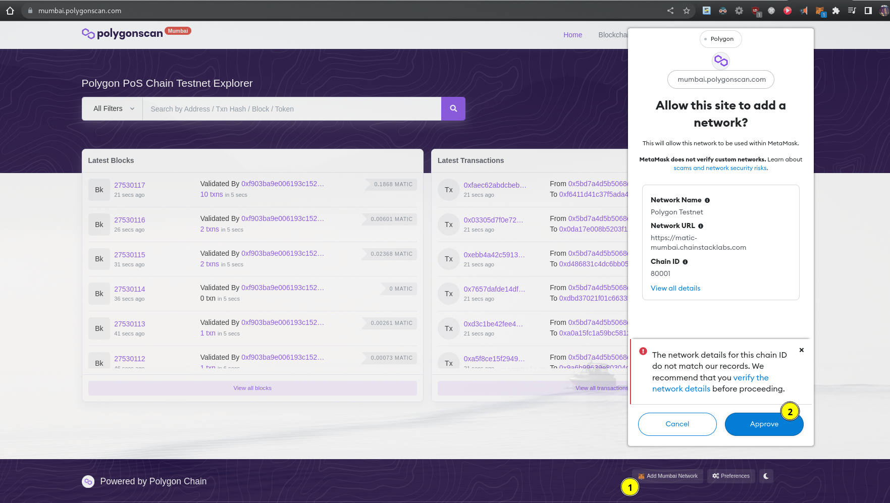
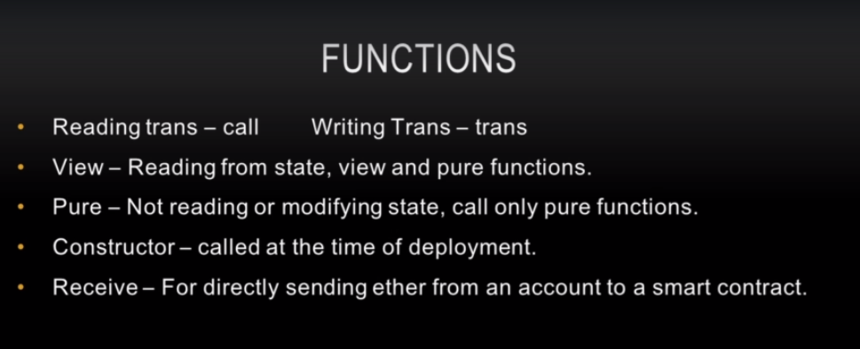
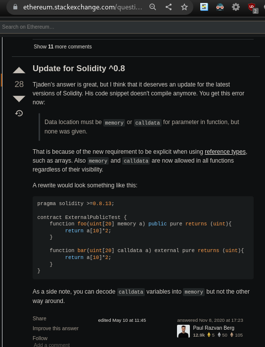
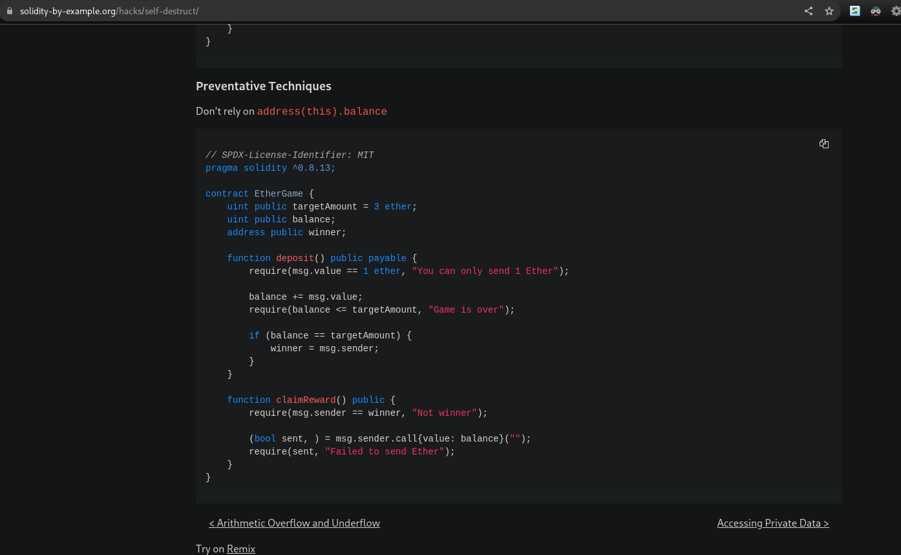

**Project deployed @** -  https://dapp-nft-marketplace-kryptobirdz.vercel.app/

## TODO CONTINUE DEPLOYING TO TESTNET:

- ***TODO: Make a script to automatic make the demo transactions for my demo app, i.e., automatic mint 5 birds on a single run of script, thats it!***

- https://hardhat.org/tutorial/deploying-to-a-live-network
- https://ethereum.org/en/developers/docs/networks/#ethereum-testnets

## Two official faucets recommended by hardhat for goerli blockchain

Source: Docs of hardhat - [Click here](https://hardhat.org/tutorial/deploying-to-a-live-network#deploying-to-remote-networks)

- https://faucets.chain.link/
- https://goerlifaucet.com/
- Mining Based (Best) - https://goerli-faucet.pk910.de/

## dapps Updated Example Sites

- State Of The Dapps - [Click here](https://www.stateofthedapps.com/)

# App Screenshots


# Never forget

**PoW(Proof of Work), PoS(Proof of stake)**

Consensus: Ethereum uses a consensus technique known as PoW(Proof of Work). The issue with Ethereum is that it necessitates a lot of processing power. Ethereum requires a significant amount of energy and It results in decreasing participation of users. This mechanism increases security to some extent. In polygon consensus is achieved by the mechanism based on PoS(Proof of stake), If a user joins the Polygon network, they would be rewarded in the form of points. Consensus is achieved faster in the Polygon blockchain.

[TOODO - Read it complete @ here](https://www.geeksforgeeks.org/ethereum-vs-polygon-which-is-better-for-nfts/#:~:text=Ethereum%20performs%20only%2013%2D15,50000%2D60000%20transactions%20per%20second.&text=Gas%20Fees-,OpenSea%20consists%20of%20the%20whole%20host%20of%20gas%20fees%20related,associated%20with%20Polygon%20on%20OpenSea.)

# Blockchain

- **Official Ethereum Networks:** [Click here](https://ethereum.org/en/developers/docs/networks/#public-networks)
- What is `hre` in `import hre from 'hardhat'`? Ans. **[Hardhat Runtime Environment](https://hardhat.org/hardhat-runner/docs/advanced/hardhat-runtime-environment)**.

https://hardhat.org/hardhat-runner/docs/advanced/hardhat-runtime-environment

Polygon Faucet: https://faucet.polygon.technology/ (adds 0.2 MATIC to your mumbai testnet accout).

​Blockchain is a shared, immutable ledger that facilitates the process of recording transactions and tracking assets in a business network. An asset can be tangible (a house, car, cash, land) or intangible (intellectual property, patents, copyrights, branding). Virtually anything of value can be tracked and traded on a blockchain network, reducing risk and cutting costs for all involved.

- **Smart contracts ARCHIVE:** https://github.com/sahilrajput03/My-Smart-Contracts

- **Removed infura's ipfs and added nft.storage ipfs** for saving files with metadata(i.e., name, description and image url). **Check [commit here](https://github.com/sahilrajput03/dapp-nft-marketplace-kryptobirdz/commit/72afbad6b5683039d0c7181a0a50e4ae468e36d9)**. _Reason: Infura's ipfs was requiring credit card to make it work accordig to new policies and it stopped working - dated: 18 Aug, 2022._

- **To be able to open ipfs:// protocol urls you can [install this](https://chrome.google.com/webstore/detail/ipfs-companion/nibjojkomfdiaoajekhjakgkdhaomnch) and enable it to access all those urls! Yikes!!** Official Page: https://docs.ipfs.tech/install/ipfs-companion/

## NFT Marketplace - Kyptobirdz

~~_Disclaimer: `p-key.txt` file related to `polygonAccount` account of metamask._~~ I am using sops encrypted `enc.env` file. Yo!!

Web3 Apps: Web3, in the context of technology, refers to decentralized apps that run on the blockchain. These are apps that allow anyone to participate without monetizing their personal data.

## start from `13. Hardhat & Infra Blockchain Configuration`

Libraries:

- `ethers` - To help us interact with ethereum blockchain
- `hardhat` - To provide us a development environment and it allows us to compile contracts and deploy our contracts to blockchain. (We're uisng `hardhat` instead of `truffle` in this project). Awesome thing: `hardhat` can also initialize the solidity contracts for us and get the project rolling so it can do little bit of that boilerplate which otherwise again would be cumbersome to do over and over again.
- `@nomiclabs/hardhat-waffle`:
- `@nomiclabs/hardhat-ethers`:
- `web3modal`: To connect with metamask and run transactions
- `@openzeppelin/contracts`:
- `ethereum-waffle`: A library which actually contains ERC721 Contracts already build to Standards. (Coz we're not going to build our nft token from scratch)
- `chai`: For testing environment
- `ipfs-http-client`: It is decentralized way of hosting our URI's or NFT images (which are files). So its a way to store files. We use this coz when our users will be tokenizing the NFT's there're gonna be hosting it IPFS.
- `axios` - To help us with http requests
- `add` - A cross-browser, numerically stable way to add floats in Javascript.
- LATEST: `@nomicfoundation/hardhat-toolbox` - A new setup instead of using `@nomiclabs/hardhat-waffle`.

```bash
npm install ethers hardhat @nomiclabs/hardhat-waffle ethereum-waffle chai @nomiclabs/hardhat-ethers web3modal @openzeppelin/contracts ipfs-http-client axios
```

**TRACK**

`hardhat` initialize our project and build out some smart contracts for us by

```bash
npx hardhat
# ✔ What do you want to do? · Create a JavaScript project
# ✔ Hardhat project root: · /home/array/test/nft-marketplace-kryptobirdz
# ✔ Do you want to add a .gitignore? (Y/n) · y

# Readme generated from above command
# ===================================

# Sample Hardhat Project

This project demonstrates a basic Hardhat use case. It comes with a sample contract, a test for that contract, and a script that deploys that contract.

Try running some of the following tasks:

# shell
npx hardhat help
npx hardhat test
GAS_REPORT=true npx hardhat test
npx hardhat node
npx hardhat run scripts/deploy.js
```

## ERC

We're using Openzepplin, so have ready made contracts. YO!

[Dev article](https://dev.to/envoy_/ks-what-are-ethereum-request-for-comments-erc-standards-5f80)

[EIP](https://eips.ethereum.org/EIPS/eip-721)

[ERC-721](https://ethereum.org/en/developers/docs/standards/tokens/erc-721/#top)

FROM `node_modules`: [Here](node_modules/@openzeppelin/contracts/token/ERC721/ERC721.sol)

You can see other contracts in ^^ that file as well:

```sol
import './IERC721.sol';
import './IERC721Receiver.sol';
import './extensions/IERC721Metadata.sol';
import '../../utils/Address.sol';
import '../../utils/Context.sol';
import '../../utils/Strings.sol';
import '../../utils/introspection/ERC165.sol';

```

We are gonna use these contracts for minting token and grabbing TOKEN_URI, setting up our IPFS.

## Useful resources

- Docs: https://docs.soliditylang.org/
- SOLIDITY BY Example: https://solidity-by-example.org/function/
- Infure Dashboard - [Click here](https://infura.io/dashboard)
- Upgrading Contracts in Solidity - [Click here](https://docs.openzeppelin.com/learn/upgrading-smart-contracts)
- Solana vs. Ethereum(solidity) 1 - [Click here](https://pixelplex.io/blog/solana-vs-ethereum/)
- Solana vs. Ethereum(solidity) 2 - [Click here](https://www.reddit.com/r/solana/comments/oes1gd/should_i_learn_solana_rust_or_ethereum_solidity/)

**Courses:**

- (HINDI) - https://www.youtube.com/playlist?list=PLgPmWS2dQHW9u6IXZq5t5GMQTpW7JL33i
- (TODO) UDEMY COURSE: Become a Blockchain Developer: Ethereum + Solidity + Project
- (**TODO** **project** for portfolio) YOUTUBE COURSE: Blockchain Ecommerce App Tutorial (Accept ERC20 Token Payments): https://www.youtube.com/watch?v=f5npM1PvoyE , [Github - unofficial's person code](https://github.com/michael-steinert/SolidityWeb3ECommerceExpressMongooseMongoDBReact)
- (TODO) ~AMAZING~ Youtube Playlist (~Polygon): BUIDL IT - Workshop #1 - Intro to Web3 Tech Stack: https://www.youtube.com/watch?v=S8hZ5rDV7kg
- @UDEMY/@GDRIVE **DONE**: Dapp course on gdrive - Build An NFT Marketplace From Scratch - Blockchain DApp: [Click here](https://drive.google.com/drive/folders/1o7eExDuepyTlyMUeospr1epx-xF9ELM9)
- @UDEMY: "Complete nft development course" - To help you create `ERC721 token` from scratch we learn the tokenomics and the functionality. **FYI: In real world we're not gonna be building from scratch every single nft.** But to solidify the the knowledge its good to learn how its done from scratch.
- @UDEMY: "Become a Blockchain Developer: Ethereum + Solidity + Project ~ Swapnil Kole"
- (**TODO**: **project** for portfolio) @AUTHOR_HOSTED/HDD: "6 Figure Blockchain Development course ~ Julien Klepatch" - OFFICIALLY HOSTED@https://pro.eattheblocks.com/p/6-figure-blockchain-developer
- Deployement Cost to Ethereum and other blockchains: [Click here](https://medium.com/the-capital/how-much-does-it-cost-to-deploy-a-smart-contract-on-ethereum-11bcd64da1)
- FROM CODEEATER >>>
- **TODO - Looks Good - Blockchain Mastery Path | Code Eater - Blockchain | Hindi** - [Click here](https://www.youtube.com/watch?v=7lUxF3t1n4I)
- **TODO - Looks Good - Solidity Full Course - 4 hours | Solidity Latest Version | Master Solidity | Hindi | Code Eater** - [Click here](https://www.youtube.com/watch?v=NqGe942J4Y0)
- **TODO - Looks Good - Solidity Project For Beginners | Deploying Smart Contract on Rinkeby | Code Eater | Hindi**): [Click here](https://www.youtube.com/watch?v=aFI_XPll_mg)
- **TODO - Looks Good - Truffle Full Course | Truffle Tutorial | Master Truffle | Hindi | Code Eater**: [Click here](https://www.youtube.com/watch?v=Zo4dYRw9WSE&t=0s)
- **TODO - Looks Good - web3.js full course | Master Web3js Library (Ethereum) | Code Eater | Hindi**: [Click here](https://www.youtube.com/watch?v=u3PtGMRmGA0)
- **TODO - Looks Good - NFT full course - PLAYLIST**: [Click here](https://www.youtube.com/playlist?list=PLgPmWS2dQHW8AUns9PlkBW_vQsPr7fO9H)
- **TODO - Looks Good - Learn Everything about Hardhat in one video | Hardhat Full Course | Hindi**: [Click here](https://www.youtube.com/watch?v=6SYsy1ZlOPo)
- **TODO - Looks Good - Blockchain Full Course - 6 hours | Blockchain Tutorial | 3 courses in 1 | Hindi | Code Eater**: [Click here](https://www.youtube.com/watch?v=6aF6p2VUORE)

## LEARN

- You can deploy to local blockchain by running the `start-local-blockchain` script and use `deploy-local-KryptoBird` to deploy to local blockchain you just started.
- `artifacts` folder in generated when you run `deploy-local-KryptoBird` script.

## now?? 8 August, 2022

**TODO NOW:**

- Deploy a solidity smartcontract on polygon testnet: https://youtu.be/c80AHFOo63M?t=412
  - (COPY^^):Hardhat - Deploying Smart Contract to Ethereum (Testnet / Mainnet): https://youtu.be/Uvphp4aVeDg
  - youtube search: https://www.youtube.com/results?search_query=deployment+to+mumbainet&sp=CAASAhAB
  - google search: do if required..
  - read article: https://blog.polymath.network/solidity-tips-and-tricks-to-save-gas-and-reduce-bytecode-size-c44580b218e6

**TOOLS:**

- Polygonchian Explorer: https://polygonscan.com/
- Infura: https://infura.io/

**Article / Videos / Interviews:**

- **INTERVIEW** Deep Talk with Jaynti Kanani - CEO & Co-founder of Matic (Polygon): Start watching from: https://youtu.be/XsKRaMhX3Iw?t=137
- **INTERVIEW** Matic Network | BlockchainBrad EXCLUSIVE Interview with MATIC COO | An Ethereum Scalability solution: Start watching from here: https://youtu.be/XZcBbKf8lRI?t=1115
- **ARTICLE** Matic: https://www.moneycontrol.com/news/business/startup/from-diamond-factory-workers-son-to-founder-of-10-billion-crypto-venture-the-story-of-jaynti-kanani-and-polygon-7007481.html
- **VIDEO** Polygon Tv CHANNEL: https://www.youtube.com/c/PolygonTV, src: https://polygon.technology/developers

## OTHER DISTURBED THINGS BY THIS NFT PROJECT

- [Auth for New Devs: It’s Easier Than You Think](https://www.youtube.com/watch?v=h6wBYWWdyYQ)
- [Build and Deploy a blockchain network for FREE: IBM Blockchain Tutorial #2](https://www.youtube.com/watch?v=mkVUW1KroTI)
- IMP: https://vimeo.com/34017777
- FIGMA COURSE: https://www.udemy.com/course/mastering-figma-beginner-to-expert/learn/lecture/20734372?start=30#overview
- What is payable in solidity - google search - [Click here](https://www.google.com/search?q=payable+in+solidity&oq=payable+in+solidity&aqs=chrome.0.0i512j0i22i30l4j0i390l4.3586j0j1&sourceid=chrome&ie=UTF-8)
- solidity-by-example.org/payable: https://solidity-by-example.org/payable/
- 30 Video Playlist by EatTheBlocks: https://www.youtube.com/playlist?list=PLbbtODcOYIoERW44kh3LbUn24eZnHvS1-
- Paid Courses by EatTheBlocks: https://pro.eattheblocks.com/

## Enabling test network in metamask

1.


2.


## Minting/Creating nft with an account using metamask on websites

1.


2.


## Buying an nft looks like this


and on completion we get


## Successful transaction address


## What is mumbai-testnet


## We cannot delete accounts created (but imported ones can deleted) on metamask and it'll be there foreever

Source: Deleteing imported accounts in metamask (Official Docs): [Click here](https://metamask.zendesk.com/hc/en-us/articles/360057435092-How-to-remove-an-account-from-your-MetaMask-wallet)


## More on theory part

- 
- 
- 
- 
- 
- 
- 
- 
- 
- 

**Modifier are used to check user input conditions. Events are used to trigger some outside applications. Event tells the client side applications that some change has been done.**

**Smart contracts need an address to deploy and invoke its functions.**

## Using account 3 with Remix IDE


## Get money in your test wallets i.e, `KovanETH`

@: https://faucets.chain.link/

Source: https://github.com/MetaMask/metamask-extension/issues/5439#issuecomment-990094952

Other multiple Source: https://github.com/MetaMask/metamask-extension/issues/5439#issuecomment-990402909

Promising for 10 coins in 30mins(7:40pm): https://faucet.egorfine.com/

## Hello world contract deployed via remix IDE

- 
- 
- 
- 
- Checking Logs to get Event send by the transaction:


- Checking Logs to get Event send by the transaction:


- Add polygon mumbai testnet to metamask [source](https://docs.polygon.technology/docs/develop/metamask/config-polygon-on-metamask/):




- Add polygon mainnet to metamask [source](https://docs.polygon.technology/docs/develop/metamask/config-polygon-on-metamask/) :


- Mumbai Testnet and Mainnet in Metamask


- web2 and web3


- bitCoin price analysis


- Learn remix ide: FYI: I used locally run hardhat blockchain instead of mumbai-testnet bcoz mumbai-testnet was resolving single request in 5-15mins for me.


- `hadhat node` accounts are same everytime (in node and as well as testing {see 2nd screenshot below to understand}) and for all the users everywhere WHEREAS truffle's accounts might change during development (truffle sucks in this sense):


- Type of blockchain developers: 

## hardhat vs. truffle:

Source: https://youtu.be/tfQFk6pmtFc

Source: https://youtu.be/Si3nmjyQXds

Source: https://www.youtube.com/watch?v=eR_9XSfF9p8

What are hardhat and truffle? Ans. They are frameworks for developing dapps of javascript.

Why frameworks? Ans. Because provide out of the box facilities to write tests and one command deployment features.

Hardhat and Truffle do the same thing i.e, speed up the development process for blockchain applicationgs and smart contracts in particular.

In truffle: `web3js` is default but if you wanna configure to use `etherjs` then its a tricky thing to do.

Truffle is a opinionated framework.

In truffle when you deploy contracts to blockchain you need to make migration files to do that and that works in a particular way and they have particular syntax on doing that. For e.g., https://github.com/dappuniversity/eth_swap/blob/master/migrations/2_deploy_contracts.js

Default way to use truffle essentially is to use their external blockchain known as ganashe. Ganashe can be accessed via cli: `ganashe-cli` whereas hardhat has `hardhat node`

Using truffle/hardhat nodes for real blockchain development of their implementations: https://youtu.be/tfQFk6pmtFc?t=711

## hardhat commands

```bash
# Compile contracts and it creates two folder i.e., cache and artifacts which have corresponding .json (has abi: used to interact with the smart contract and the bytecode which is used to deploy smart conract) compiled file.
npx hardhat compile
```

## uint256?

https://medium.com/hara-engineering/how-long-will-uint256-last-47f9796e171e

## Installed `hardhat-watcher`

Usage - Docs: https://github.com/xanderdeseyn/hardhat-watcher#usage

```bash
npm install hardhat-watcher
```

And addded below script to `package.json`

```js
require('@nomiclabs/hardhat-waffle')

// Also add below to default export config object:
{
  // ...,
  watcher: {
  'learn-contracts': {
    tasks: ['test'],
    files: ['./contracts', './test'],
  },
},
}
```

and create a script in `package.json` like:

```json
"test-watch-learn-contracts": "hardhat watch learn-contracts",
```

so we can use `npm run test-watch-learn-contracts` to run tests in watch mode.

### temporary truffle urls

```bash
yarn develop truffle
# from youtube's course of ecommerceWeb3
```

- Writing Test in Solidity: https://trufflesuite.com/docs/truffle/testing/writing-tests-in-solidity/
- Writing Test in JS: https://trufflesuite.com/docs/truffle/testing/writing-tests-in-javascript/
- Debugger: https://trufflesuite.com/docs/truffle/getting-started/using-the-truffle-debugger/

## more urls

- 15 Aug: Amzing Youtube Channel for web3 - EatTheBlocks - Are You Still Using Block.Timestamp like this? - https://youtu.be/GLrz3Qyi4io
- SOLIDITY Hardhat Typescript Template: https://github.com/xanderdeseyn/solidity-hardhat-template
- learn x in y mins - solidity: https://learnxinyminutes.com/docs/solidity/
- hardhat runner docs: https://hardhat.org/hardhat-runner
- hardhat networK: https://hardhat.org/hardhat-network
- All Courses from Swapnil Kole on UDEMY: https://www.udemy.com/user/swapnil-kole-2/
- Swapnil Kole: Linkedin: https://www.linkedin.com/in/swapnil-kole-8a386819b/
- Dapp univ (sponsored by EatTheBlocks): https://www.youtube.com/c/DappUniversity
- FLASH LOANS PLAYLIST (Eat the blocks): https://www.youtube.com/playlist?list=PLbbtODcOYIoEMz-XatfkcFMsEwMmYShwk

## web3js(15.8k*) and ethersjs(5.4k*)

https://youtu.be/Si3nmjyQXds

more?

## temp




- [Docs - Transaction Response - Etherjs](https://docs.ethers.io/v5/single-page/#/v5/api/providers/types/-%23-providers-TransactionResponse) -


- Harhat testing


- Source Stackoverflow answer: [Click here](https://ethereum.stackexchange.com/a/19391) **_(PLEASE SEE THE UPDATE OF THIS ANSWER AS PER LATEST STANDARDS BELOW THIS IMAGE)_**


**UPDATED ANSWER COZ ( ABOVE IS EXPIRES NOW):**



- What happens with selfdestruct function?


**Boilerplate contract:**

- https://solidity-by-example.org/hacks/self-destruct/

```txt
decentralized exchange - one can buy and sell ethereum tokens in a decentralized way without any thirdparty.

- what is uniswap?
- COINBASE: Trading Platform: https://www.youtube.com/watch?v=64GhiDvem4o
```

- Different blockchains in market right now:


- Different blockchain libs download on npm:


- Some top defi apps and their blockchain used:


- Jobs with ethereum requirement in US only:


- Ethereum, should I?


- dapps vs. apps:


- Set formatter for solidity as official hardhat vscode extension: its awesome!!!


- Simplified bitcoin blockchain:


- What does transaction looks like:


- Address looks like this:


- security:


- gas optimization:


- Deployment using infra:


- watch todo: https://youtu.be/nYeVqMRK-yc

Exerpt from Julien:

```txt
1st generation Blockchains: Bitcoin and Monero. These blockchains are capable of doing simple transactions like send and receiving money to the accounts of each other and this is very limited capability of this 1st geenration blockchains.

2nd generation Blockchains: Ethereum. It can run small programs called smart contracts. These smart contracts can manipulate crypto currencies like ether.

3rd generation Blockchains: EOS, Tron, Hyperledger. This generation of blockchain can also run smart contracts however they can process many more transactions and so we can say these blockchains are way more scalable.  ALERT: They are actually distributed databases somewhat inspired from blockchain technology HOWEVER these are not truly blockchains

OTHER POINTS:
- Ethereum 2.0 is not released yet but it'll be then a 3rd generation blockchain. YO!
```

- Testing with openzepplin's helpers: https://ethereum.stackexchange.com/a/128092/106687

- TODO: Learn to make [Lottery Contract](https://solidity-by-example.org/hacks/self-destruct/) and make tests for it as well:



- I think I can use any other uploading (anyother free ipfs storage facility instead of this):

[Check this warning use of using free url at official support](https://community.infura.io/t/ipfs-hosting-files-for-free/3498)


because:


- infura ipfs pricing is not bad though:


- Getting api key from `nft.storage` for the ipfs service:


you need to give a project name then you can use that button copy that api key:


- checkout: https://solana.com/summercamp

- forking feature of hardhat (to help us run on a forked blockchain of ethereum mainnet): [Check it out in real demo](https://youtu.be/GBc3lBrXEBo?t=335), Also forking is very usefult when you have chain linked app (i.e., having some hardcoded price feed contract address in your address, thus its very helpful to run against the forked mainnet coz its like real testing). Check [what it means here](https://youtu.be/GBc3lBrXEBo?t=484). FIND ABOUT chainlink in the description of the same video. YO!

- Creating api key in https://polygonscan.com for the `POLYGONSCAN_API_KEY`:


- Official fauce of mumbai testnet: https://faucet.polygon.technology/ . FYI: Took `0.2 MATIC` -> `0.1303 MATIC` to deploy my contract! YO!

- read and write only contract instances [source](https://dapp-world.com/smartbook/how-to-use-ethers-with-polygon-k5Hn):


## Alchemy


# Goerli's Experience

Viewing a transaction of goerli on [goerli.etherscan.io](https://goerli.etherscan.io)


## Projects using web3modal?

Github: [Click here](https://github.com/WalletConnect/web3modal)
Official React Example Usage with nextjs: [Find here in these steps](https://github.com/WalletConnect/web3modal#2-follow-instructions-and-examples-for-your-favourite-framework)


## Swapnil project


**To continue from video 24 to follow up on the project's coding.**

## notice in terminal

```txt
========= NOTICE =========
Request-Rate Exceeded  (this message will not be repeated)

The default API keys for each service are provided as a highly-throttled,
community resource for low-traffic projects and early prototyping.

While your application will continue to function, we highly recommended
signing up for your own API keys to improve performance, increase your
request rate/limit and enable other perks, such as metrics and advanced APIs.

For more details: https://docs.ethers.io/api-keys/
==========================
```

## reset chain before each test?

[Source](https://ethereum.stackexchange.com/a/112437/106687)


