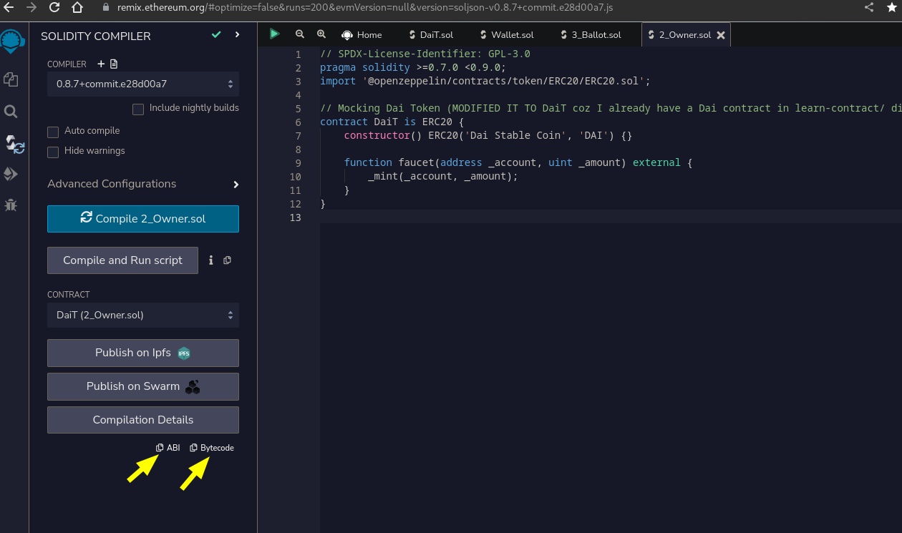
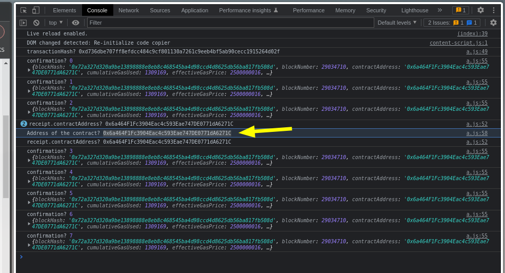

# Readme

**Deployment to Polygon Mumbai and Binance Chain Successful.**

Note: I am using web3js from `node_modules` so you must do `npm i` to get web3js accessible in `a.js` file.

- This tutorial: https://www.youtube.com/watch?v=d5YHnDZNCPU
- Another tut for deploying to polygon: https://www.youtube.com/watch?v=eADNSt6Kv-Y

**Getting abi.js and bytecode.js values from Remix:**

**Deployment successful:** Getting address of the contract.

**Viewing txn on etherscan:**

